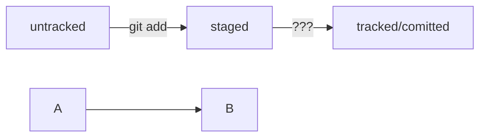
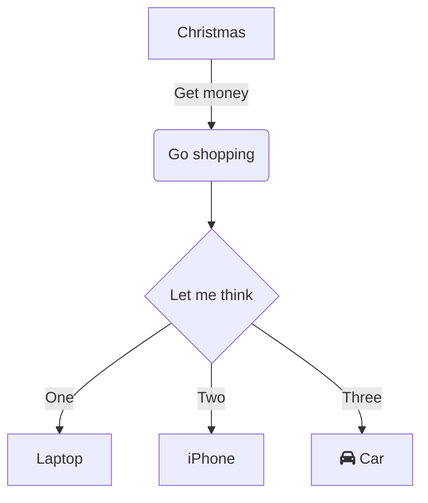
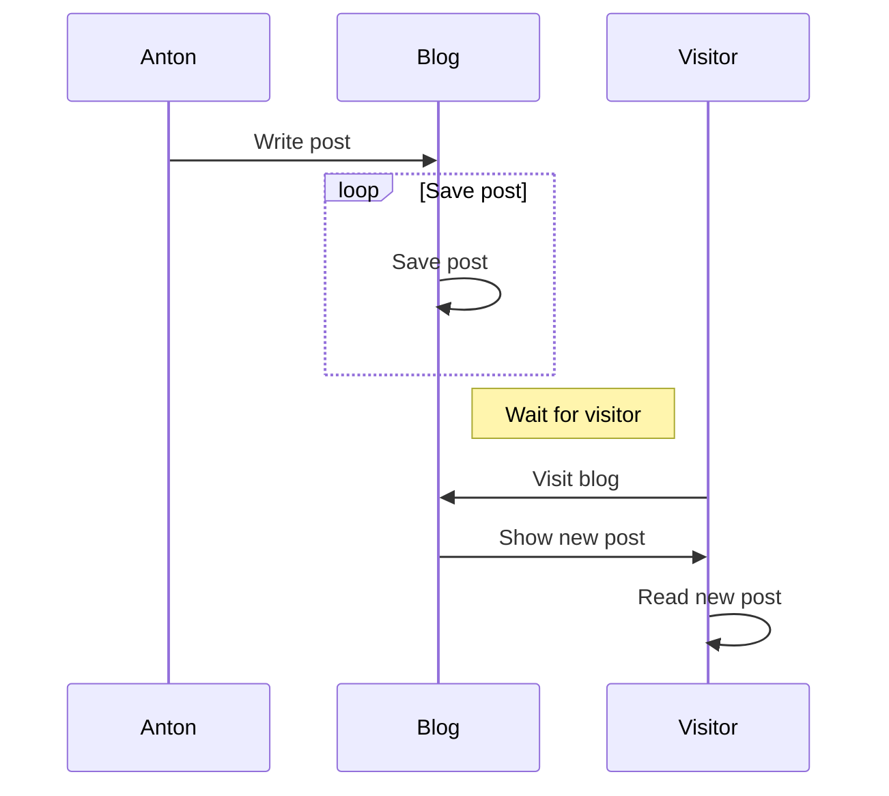

Примеры элементов разметки в Markdown:

Заголовки:
# Заголовок 1
## Заголовок 2
### Заголовок 3

Списки:
- Элемент списка 1
- Элемент списка 2
  - Подэлемент списка
1. Нумерованный элемент 1
2. Нумерованный элемент 2

Текстовое форматирование: 
Выделение текст с помощью символов `_` или `*`
*Курсив*
**Жирный**
`Инлайн-код`

Чтобы выделить текст как код, поместите его в тройные кавычки ```. 
```
mkdir my_project
cd my_project
git init
```

Ссылки:
[Текст ссылки](http://www.example.com)

Изображения:


Цитаты:
> Это цитата.

Примеры элементов разметки mermaid-схем:
тренажет по схемам https://mermaid-js.github.io/mermaid-live-editor/edit#pako:eNpVjk2Lg0AMhv9KyGkL9Q94WKi620thC-3N8RA0doY6H4yRUtT_vmN72c0p5Hnel8zY-o4xx37wj1ZTFLhWykGaQ13qaEaxNDaQZZ_LkQWsd_xcoPg4ehi1D8G42-7tF5sE5XzaNAbRxt3XNypf-R_HC1T1iYL40Pwl14df4Ks2Z53q_xMdOaW-657ynrKWIpQUXwru0XK0ZLr0_rxdFIpmywrztHbc0zSIQuXWpNIk_vJ0LeYSJ97jFDoSrgzdIllM3cPI6y9UJlb2






