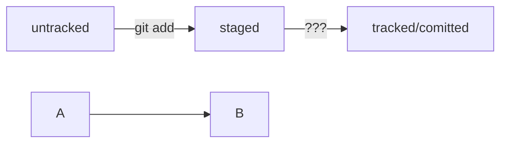

Примеры элементов разметки в Markdown:

Заголовки:
# Заголовок 1
## Заголовок 2
### Заголовок 3

Списки:
- Элемент списка 1
- Элемент списка 2
  - Подэлемент списка
1. Нумерованный элемент 1
2. Нумерованный элемент 2

Текстовое форматирование: 
Выделение текст с помощью символов `_` или `*`
*Курсив*
**Жирный**
`Инлайн-код`

Чтобы выделить текст как код, поместите его в тройные кавычки ```. 
```
mkdir my_project
cd my_project
git init
```

Ссылки:
[Текст ссылки](http://www.example.com)

Изображения:


Цитаты:
> Это цитата.

Примеры элементов разметки mermaid-схем:


HEAD -- это голова.
Коммит -- это всему голова.
Статусы файлов:
<тут пустая строка!>

```mermaid
%% описание схемы
```
<и тут пустая строка!> 


